1. Buat dan jalankan instance

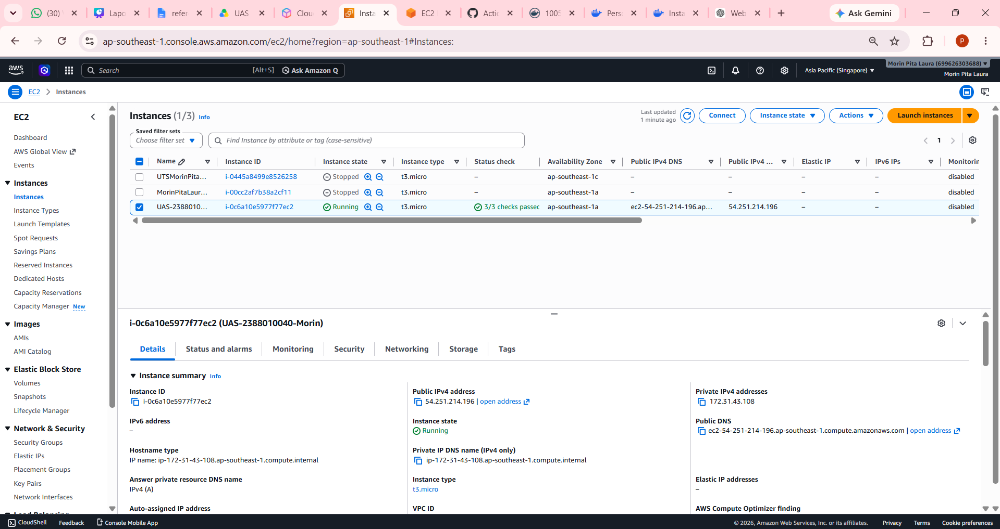

2. Buat Security Group

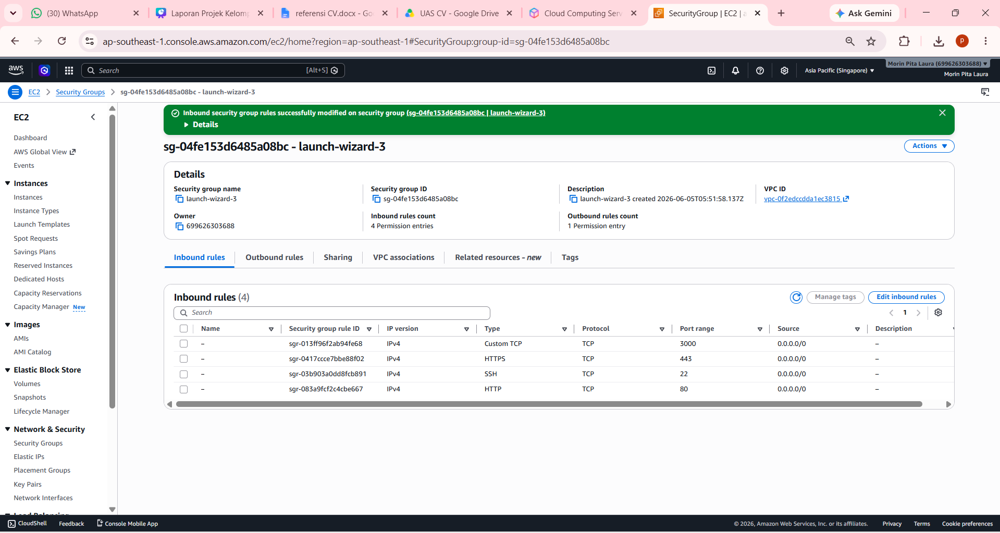

3. patching os ubuntu

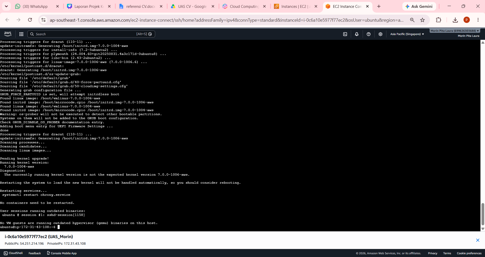

4. buat repository baru nama UAS_2388010040_Morin

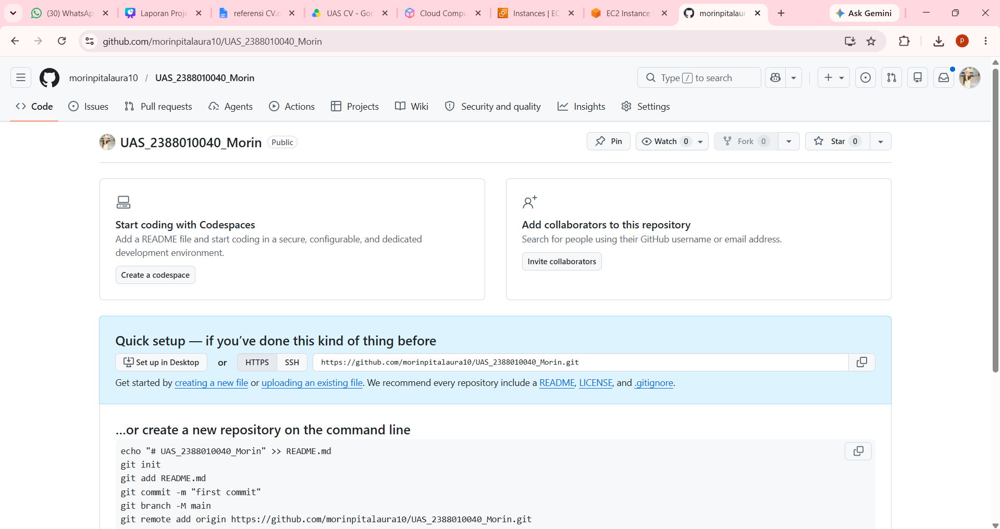

5. Install Docker

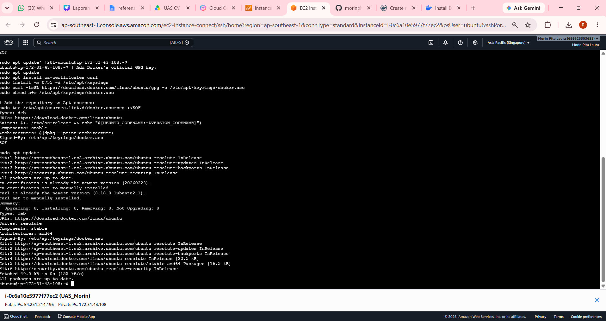

6. cek system ctl running

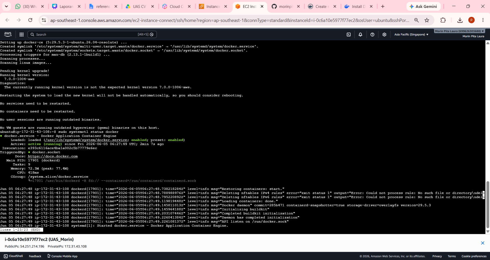

7. buat repository di docker

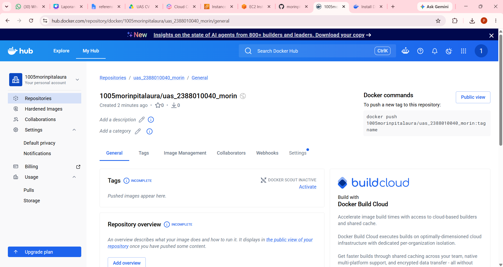

8. buat token di docker

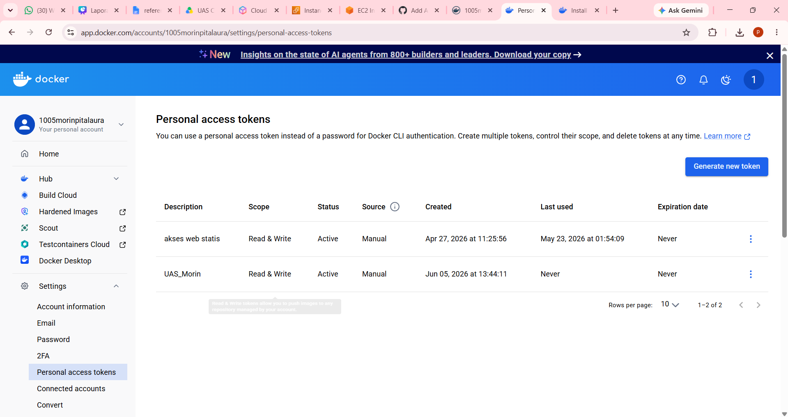

9. buat secret key di github

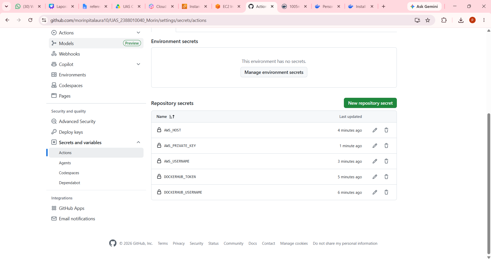

10. Deploy web statis

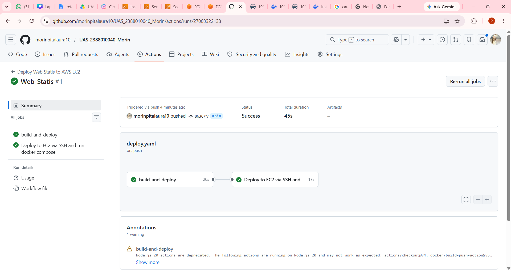

11. Tampilan Web Statis

12. Buat user accounts xampp

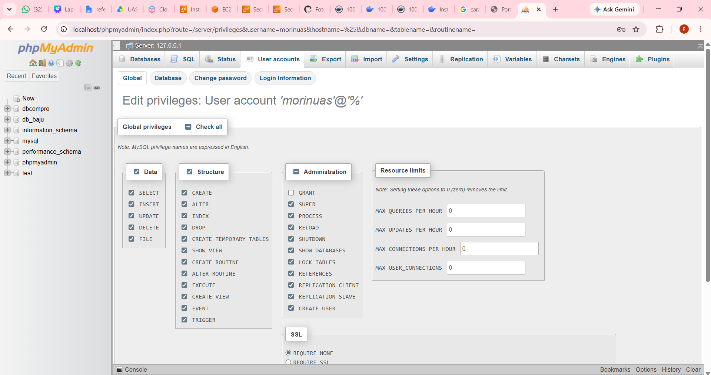

13. Buat Repositori Docker Baru

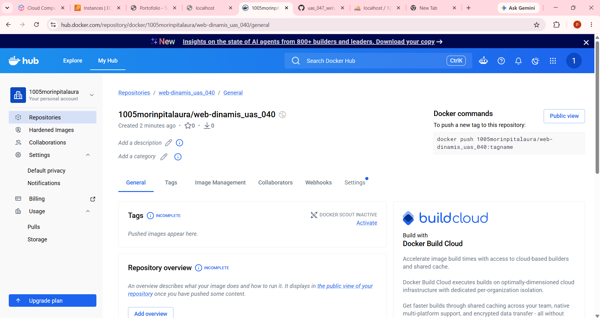

14. Deploy web statis

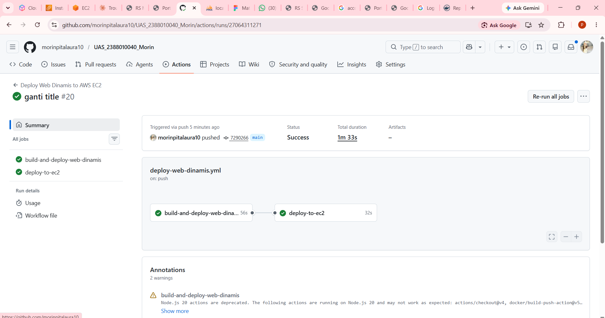

15. Tampilan web deploy

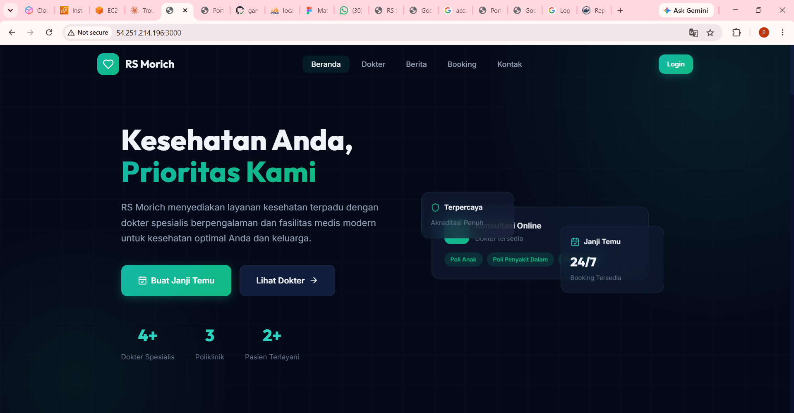

16. Edit di Admin

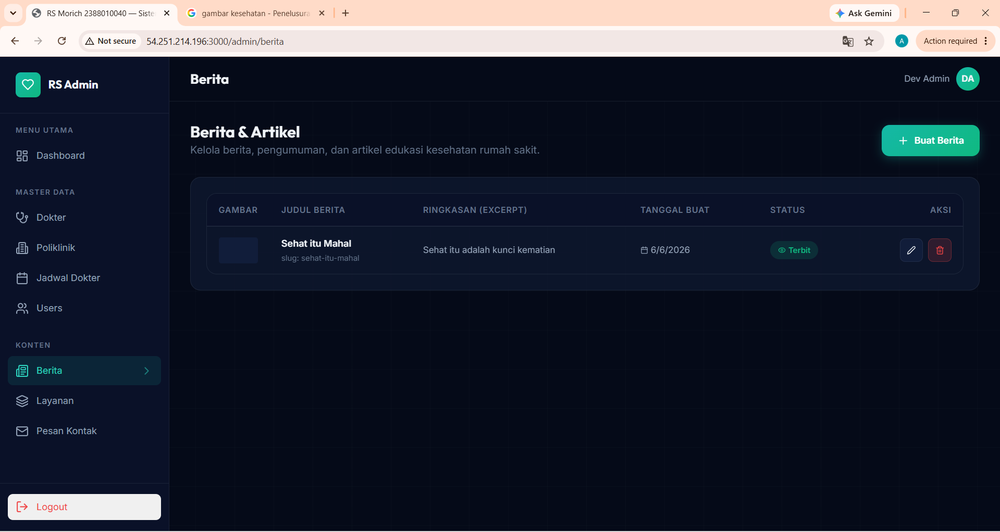

